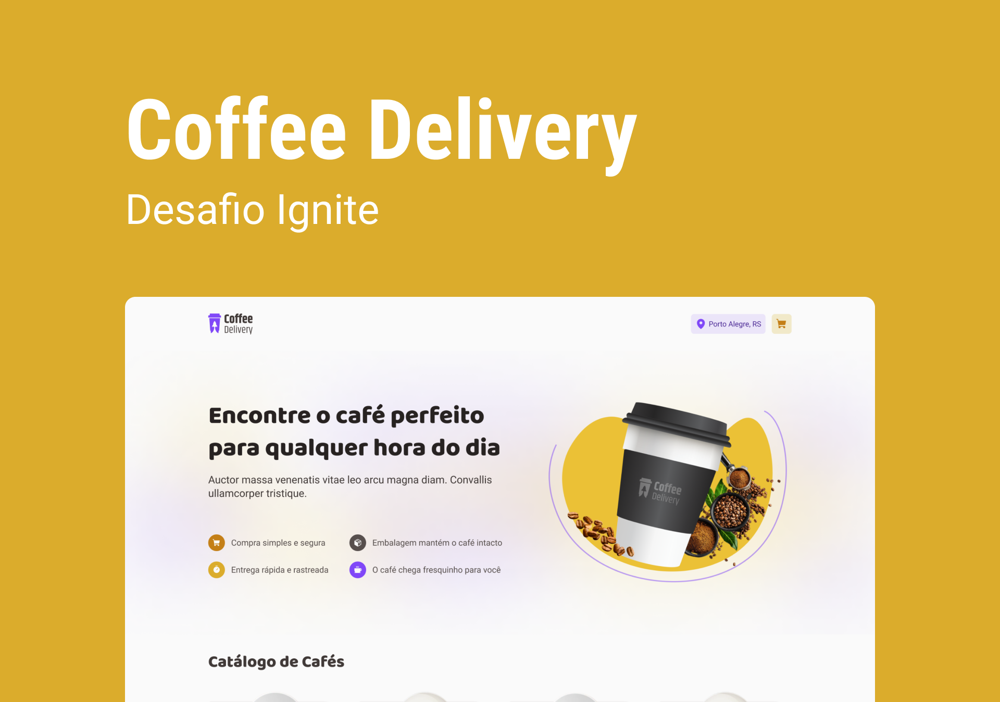

<div align="center">
  
  <h3>Sistema de carrinho desenvolvido para a trilha de react do bootcamp ignite da rocketseat</h3>
</div>

## 📃 Sobre

<br />

Este projeto foi desenvolvido para a trilha de react do bootcamp ignite da rocketseat e tem como foco fazer o aluno relembrar alguns conceitos muito importantes no react, como estado,  imutabilidade, localstorage, context api, propriedades e mais algumas coisas importantes. 

## 💻 Principais Tecnologias utilizadas no projeto

Este projeto é um pouco mais complexo que outro que já desenvolvi, então o número de dependências é maior. Abaixo você pode ver quais libs estou usando e se gostar você pode utilizar em alguns dos seu projetos também.

- [Vite](https://vitejs.dev/)
- [React](https://pt-br.reactjs.org/)
- [Typescript](https://www.typescript)
- [Styled-components](https://styled-components.com/)
- [Phosphor-icons](https://phosphoricons.com/)
- [React-hook-form](https://www.react-hook-form.com/get-started)
- [React-router-dom](https://v5.reactrouter.com/web/guides/quick-start)
- [React-hot-toast](https://react-hot-toast.com/)
- [Immer](https://www.npmjs.com/package/immer)
- [Zod](https://www.npmjs.com/package/zod)

## Funcionalidades

Este projeto possui algumas funcionalidades bem legais que ajudam muito os iniciantes no desenvolvimento web com react. as funcionalidades são:

- Listagem de produtos (cafés) disponíveis para compra

- Adicionar uma quantidade específica de itens no carrinho

- Aumentar ou remover a quantidade de itens no carrinho

- Formulário para o usuário preencher o seu endereço

- Exibir o total de itens no carrinho no Header

- Exibir o valor total da soma de itens no carrinho multiplicados pelo valor

## Como executar o projeto na sua máquina

<br />

Para executar o projeto você terá de seguir os passos listados abaixo. 

Primeiro clone o repositório do projeto com o comando:

<br />

```bash
git clone git@github.com:henrique998/Coffee-Delivery.git
```

Execute um dos comando abaixo para instalar as dependências do projeto:

```bash
npm install
# OU
yarn install
```

<br />

Agora está tudo pronto para iniciar o projeto. execute o comando abaixo para iniciar o servidor:

<br />

```bash
npm run dev
# OU
yarn dev
```

## Contato

<br />

Entre em contato comigo por email ou no linkedin:

- henriquemonteiro037@gmail.com
- [linkedin](https://www.linkedin.com/in/henrique-monteiro1/)